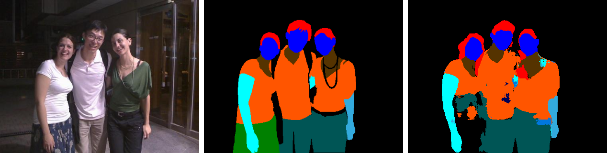

# Multiclass Segmentation on Crowd Instance-level Human Parsing (CHIP) Dataset using UNET
This repository contains the code for the Multiclass Segmentation using the UNET architecture on the Crowd Instance-level Human Parsing (CHIP) Dataset. The complete code is written using the TensorFlow frameowork.

## Dataset
Download the dataset: [Crowd Instance-level Human Parsing (CHIP)](https://drive.google.com/uc?id=1B9A9UCJYMwTL4oBEo4RZfbMZMaZhKJaz)

## Results
The sequence of the images are: 1) Input Image 2) Ground Truth Mask and 3) Prediction Mask

